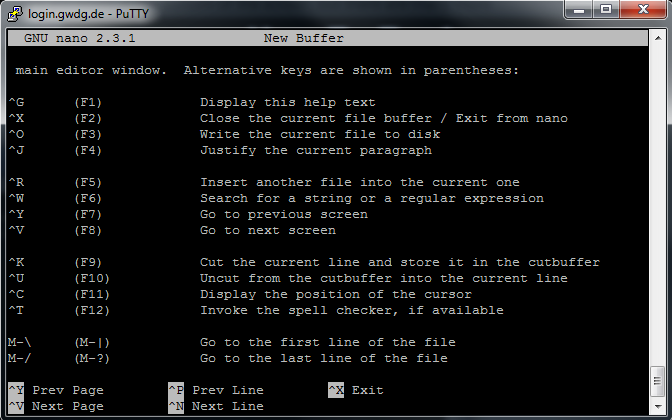
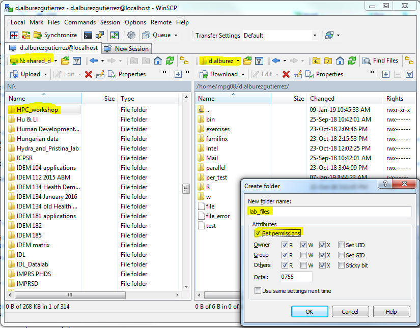

Hands-on lab (First Part)
================

-   [1. Connecting to the cluster using Windows](#connecting-to-the-cluster-using-windows)
-   [2. Working with files and directories](#working-with-files-and-directories)
-   [3. File transfer with WinSCP](#file-transfer-with-winscp)
-   [4. The cluster and queue system](#the-cluster-and-queue-system)
-   [5. Running the R Console from the terminal](#running-the-r-console-from-the-terminal)
-   [6. Sources](#sources)

### 1. Connecting to the cluster using Windows

#### 1.1. Connect to the GWDG network

Connecting to a GWDG frontend is a two-step process if you are working from outside the GWDG network (e.g. from the MPIDR or from home). First, you need to first establish a connection to the GWDG network. For this:

1.  Open Putty (available from the intranet) and change the following settings
2.  Host Name: `login.gwdg.de`; Port: `22`; Connection Type: `SSH`
3.  **Connection** | **Data**: Auto-login username: **firstname.lastname** (you can find your username by logging into [your GWDG account](https://www.gwdg.de/))
4.  `Save` the session and open it using you MPIDR password (no asterix will appear as you type)
5.  Acknowledge Putty's security alert by clicking on 'Yes'

You are now logged into the GWDG network. *Well done!*

However, you are not yet connected to any of the three frontends (gwdu101.gwdg.de/, gwdu102.gwdg.de/, or gwdu103.gwdg.de/). To do this we must open a new ssh connection.

#### 1.2. ssh to a frontend

Since the GWDG frontend servers cannot be accessed from the Internet directly, we cannot use Putty for this. To establish an ssh connection to one of the frontend, type the following on the Putty terminal:

``` bash
ssh gwdu102.gwdg.de
```

> The authenticity of host ’gwdu101.gwdg.de (134.76.8.101)’ can’t be established. ECDSA key fingerprint is SHA256:sIJNEepmILeEq/7Zqq4HCtpTM8L98arWTny5EiAX+gI. or ECDSA key fingerprint is 7c:52:2b:17:f8:ba:29:bd:c5:45:d1:1a:9e:8d:d6:f0. or RSA key fingerprint is b9:f9:46:0f:23:c8:8d:76:b9:83:b9:1b:f6:5e:d5:6b. Are you sure you want to continue connecting (yes/no)?

Accept the connection by typing 'yes'.

Welcome to the the gwdu102.gwdg.de frontend of the GWDG cluster! If you see something like this, you are now ready to write Linux commands in the terminal:

``` bash
gwdu102:5 10:37:08 ~ >
```

### 2. Working with files and directories

#### 2.1. Basic Linux commans - a refresher

These are some useful Linux commands that we will use in the next section to create, explore, and edit files from the terminal:

| Command       | Description                              |
|---------------|------------------------------------------|
| pwd           | show current directory                   |
| cd            | change directory                         |
| top           | display processes as a sorted list       |
| ps            | display current process                  |
| touch         | create file                              |
| cat           | print file content                       |
| cp            | copy file                                |
| rm            | remove file                              |
| mv            | move file                                |
| mkdir         | new directory                            |
| rmdir         | remove directory                         |
| ln            | create (hard or symbolic) link to a file |
| df (-h) (-hl) | show disk space                          |
| chmod         | change file attributes                   |

#### 2.2. \[Optional\] Changing language to English

By default, the cluster operates in German. You can check the language settings by typing:

``` bash
echo $LANG
```

You can change this for the current session:

``` bash
export LANG=en_US.UTF-8
```

For a permanent solution, add the command to the `.profile` file with:

``` bash
echo 'export LANG=en_US.UTF-8’ >> ~/.profile
```

#### 2.3. Exploring and modifying directories

To list the files in your current directory, type `ls`

``` bash
ls
bin exercises familinx intel Mail
```

To see more details, type `ls -l` or `ls -la`

``` bash
ls -la

drwx------   2 d.alburezgutierrez MRDF     0 Sep 25 10:42 bin
drwx------   3 d.alburezgutierrez MRDF     0 Oct 23 14:09 exercises
drwx------   4 d.alburezgutierrez MRDF     0 Oct 23 14:15 familinx
drwx------   3 d.alburezgutierrez MRDF     0 Oct 23 12:02 intel
drwx------   2 d.alburezgutierrez MRDF     0 Sep 25 10:42 Mail
```

#### 2.4. Permission settings

The previous command showed a series of permission settings associated with each file in our current directory.

The first character indicates the special permission flag. This can be `d` for directory, `-` for a normal file without special persmission, `l` for a symlink, etc.[1] We will focus on the characters in the other positions:

| Position | Permission | User type         |
|----------|------------|-------------------|
| 2        | read       | User (file owner) |
| 3        | write      | User (file owner) |
| 4        | execute    | User (file owner) |
| 5        | read       | Group             |
| 6        | write      | Group             |
| 7        | execute    | Group             |
| 8        | read       | Others            |
| 9        | write      | Others            |
| 10       | execute    | Others            |

New files and directories are created by default with the following permission settings: `-rw-------`, meaning that only the owner can read and write. To alter file permissions we can use the `chmod` command. The basic usage is:

``` bash
chmod {options} filename
```

There are two ways of changing permissions: by specifying the `{options}` with numbers (octals) or with letters. In this tutorial we will only cover letters, as this is more intuitive. The GWDG presentation referenced at the end of this document provides a more detailed description of the use of `chmod` for altering permission settings.

| chmod Options | Definition                          |
|---------------|-------------------------------------|
| u             | owner of the file                   |
| g             | user group that the file belongs to |
| o             | other users                         |
| a             | all of the above                    |
| x             | execute                             |
| w             | write                               |
| r             | read                                |
| +             | add permission                      |
| -             | remove permission                   |

Let's see an example. First we will create an empty directory, check it's current permission settings, and then edit these to make the directory 'ready-only' (i.e. remove 'write' permissions).

``` bash
mkdir per_test
ls -l
```

This will show the current permission settings, giving full control over the directory to the user:

``` bash
...
drwx------ 2 d.alburezgutierrez MRDF  1 Jan  4 12:59 per_test
...
```

As an exercise, we will create `file1` within our new directory `per_test` and save some text to it. (Note that the command `echo` appends the text "GWDG cluster workshop" as a new line in `file1` using the `>>` operator.)

``` bash
cd per_test
touch file1
echo GWDG cluster workshop >> file1
ls -l
cd ..
```

To remove the 'write' permissions of the directory, simply type:

``` bash
chmod u-w per_test
ls -l

...
dr-x------ 2 d.alburezgutierrez MRDF  1 Jan  4 12:59 per_test
...
```

It is now impossible to create new files within `per_test` as we did before (note that the 'execute' (`x`) permission is needed to access the directory):

``` bash
touch file_error /per_test

touch: cannot touch ‘/per_test’: Permission denied
```

However, we can still edit the existing `file1`:

``` bash
echo This is a new line >> per_test/file1
cat per_test/file1

GWDG cluster workshop
This is a new line
```

By displaying the content of the directory `per_test` we can see that the permission changes were not inherited to `file1`. This behaviour can be changed with the `-R` (recursive) option, but this is generally not advised.

<!-- ```{r, engine = 'bash', eval = FALSE} -->
<!-- ls -l per_test -->
<!-- -rw------- 1 d.alburezgutierrez MRDF 0 Jan  4 12:59 file1 -->
<!-- ``` -->
Permissions are useful for granting and restricting access to specific directories and files in a way that will be familiar to users of the MPIDR's `N:` drive. However, note that the cluster administrators have access to all directories stored in the cluster. Please do not store sensitive information in the cluster without first getting in touch with the GDGW security team.

#### 2.5. Editing text files from the terminal with `nano`

The terminal is the only way of interacting with the GWDG cluster. Graphical User Interface (GUI) are, with a few exceptions, not available. Text files can be edited from within the terminal using editors such as: `vi`, `mcedit`, `joe`, or `nano`.

In this tutorial we will use `nano`. To run it, simply type `nano {filename}` on the terminal. The `{filename}` can be omitted if you want to create a new file from within nano. Let's try it out.

``` bash
touch test
nano test
```

Write some text to save in your file and press `Ctrl`+`x` to exit (and save). We can now check that the changes were saved by printing the file:

``` bash
cat test
Hello World!
```

You can see all the `nano` keyboard shortcuts by pressing `Ctrl`+`G`.



### 3. File transfer with WinSCP

In this section we will learn how to upload files to the cluster with an SCP client for Windows. WinSCP is an open-source client available from the internet and MPIDR intranet.

First we must create a new WinSCP session. TO do this:

1.  Open WinSCP (from Desktop shortcut)
2.  Clicking on `New Site` to start a new session with the settings:
3.  File protocol `SCP`, Host name `transfer.gwdg.de`, Port number `22`, User name **firstname.lastname**
4.  Login with your MPIDR password

To create a sub-folder, click in the remote windows (right), press F7, enter the folder name (e.g. mickey.mouse) and set the permissions as necessary.

#### 3.1. Exercise: uploading scripts

We will now upload the scripts that you will use in the second part of the lab to your `$HOME` directory. The files are saved in the `N:` drive.

Transferring files from a local directory to the cluster using WinSCP is easy:

1.  Create a new directory in our home directory called `lab_files`. You can edit permission setting at this stage (see image below)
2.  On the left panel of WinSCP, navigate to `N:\HPC_workshop\lab_files`
3.  Select the files you want to upload, and drag and drop them on the newly created `lab_files` directory in the cluster (right-hand-side panel)



#### 3.2. End of line markers


Special care needs to be taken when transfering text files between operating systems as end of lines (EOL) are recorded differently in Windows (`\r\n`) and Linux (`\n`). 
You can use `Notepad++` to translate the files before uploading them to the cluster (navigate to **Edit | EOL Conversion**). This has already been done for the files provided in this tutorial.  

#### 3.3. File storage in the cluster

-   $HOME: our home directory is available everywhere, permanent, and comes with backup, but it is comparatively slow.

-   /scratch: this is the shared scratch space, available on *gwda, gwdc*, and *gwdd* nodes and on the frontends *gwdu101* and *gwdu102*. For being sure of having a node with access to shared */scratch* the command `-R scratch` must be written in the shell file.

-   /scratch2: this is the shared scratch space, available on *dfa, dsu, dge*, and *dmp* nodes, and on the frontend *gwdu103*. For being sure of having a node with access to shared */scratch2* the command `-R scratch2` must be written in the shell file.

### 4. The cluster and queue system

For submitting jobs to the cluster it is necessary to create a `shell file` using a `batch system` through LSF commands. So, the GWDG cluster is operated by the LSF platform, which is operated by shell commands on the frontends. The **frontends** are special nodes (gwdu101, gwdu102, and gwdu103) provided to interact with the cluster via shell commands.

The batch system distributes the processes across job slots, and matches the job's requirements to the capabilities of the job slots. Once sufficient suitable job slots are found, the job is started. LSF considers jobs to be started in the order of their priority.

It is also necessary to know how the cluster is structured:


Source: [GWDG documentation](https://info.gwdg.de/dokuwiki/doku.php?id=en:services:application_services:high_performance_computing:running_jobs).

#### 4.1. Processing jobs on the cluster

Jobs are usually not run *interactively* in the GWDG cluster. Computer-intensive jobs are submitted to specific *queues* of the cluster. These jobs are not processed immediately, but rather *stand in the queue* until the necessary resources are made available for the cluster to run them (for more info, see the [official documentation](https://info.gwdg.de/dokuwiki/doku.php?id=en:services:application_services:high_performance_computing:running_jobs)).

Submitting a job is a two-step process consisting of

1.  Creating a job script
2.  Submitting the job script to a GWDG queue for execution

#### 4.2. The job script

Job scripts are shell scripts with special comment sections (`#BSUB`) that force each line to be interpreted as an option of `bsub`. The job files can be created through either the Linux terminal using the editor *nano* or Notepad++ in Windows.

A typical job script looks something like this:

``` bash
#!/bin/sh 
#BSUB -N 
#BSUB -u <email address>
#BSUB -q <queue to submit job to> 
#BSUB -W <max runtime in hh:mm>
#BSUB -o <file path> 
 
<Command to execute>
```

#### 4.3. Submitting (non-parallel) job scripts with the `bsub` command

The `bsub` command submits information regarding your job to the batch system. The basic syntax:

``` bash
bsub <bsub options> [mpirun.lsf] <path to program> <program parameters>
```

#### 4.4. Some `bsub` parameters

-   -N: sends the job report to you by email when the job finishes.
-   -q: select queue to submit the job to
-   -u: sends the email to the specified email destination.
-   -W: sets the maximum runtime limit of the job. If this time is exceeded the job is killed.
-   -o: appends the standard output of the job to the specified file path. (`%J` is a place holder for the job ID)

All the parameters of `bsub` can be specified via the terminal but this results in very long commands. Job scripts can be used instead to specify all relevant parameters of `bsub`.

#### 4.5. Example: submitting jobs to the queue

In this example, we will submit a simple R script to the `mpi` queue of the cluster using four gwdg nodes reserved for this workshop (the `#BSUB -U workshop` line in the script below).

We will use the R script `1_exercise.R` in the newly created `lab_files` directory. The script prints the header lines of the `airquality` dataset. Display the content of the script using the `cat` command:

``` bash
cd lab_files
cat 1_exercise.R

#!/usr/bin/env r 
data("airquality")
print(head(airquality, 6))
```

We now create a simple job script using `nano`. Note that `1_exercise.R` is preceded by the `Rscript` command, which is used to run R scripts non-interactively.

``` bash
nano job_script.sh

--Copy and paste this text-------
#!/bin/sh 

#BSUB -q mpi
#BSUB -U workshop
#BSUB -o NameOutput.%J.txt 
 
Rscript 1_exercise.R
-------------------------------
```

Once the job script has been created, we submit the job to the queue using the `bsub` command:

``` bash
bsub < job_script.sh
```

Use `ls` and `cat` to explore the output file created in the directory of execution.

#### 4.6. Other job-processing LSF commands

-   bjobs: lists currents jobs.
-   bhist: lists older jobs.
-   lsload: status of cluster nodes.
-   bqueues: status of cluster nodes.
-   bhpart: shows current user priorities.
-   bkill <jobid>: stops the current job

### 5. Running the R Console from the terminal

To start an interactive R session, type `R` into the terminal. From here, we will now install the `doParallel` R package (don't forget the `dependencies = TRUE` argument!):

``` r
install.packages("doParallel", dependencies = TRUE)
library(doParallel)
```

<!-- ## And after lunch... -->
<!-- Click [here](https://github.com/Parimucyeran/Parallel_Course/blob/master/Github.md) for the Second Part of the Hands-on lab! -->
### 6. Sources

-   Boehme, C. and Ehlers, T. (2018) Using the GWDG Scientific Compute Cluster - An Introduction. Goettingen: GWDG. [\[link\]](https://info.gwdg.de/docs/lib/exe/fetch.php?media=en:services:scientific_compute_cluster:parallelkurs.pdf)
-   GWDG/DOCS: Running Jobs [\[link\]](https://info.gwdg.de/dokuwiki/doku.php?id=en:services:application_services:high_performance_computing:running_jobs)
-   MPIDR Intranet IT FAQ [\[link\]](https://intranet.demogr.mpg.de/home/support/it/faq)

[1] For more information on permission settings in Linux, see [this link](https://wiki.archlinux.org/index.php/File_permissions_and_attributes) and [this one](http://linux-training.be/funhtml/ch33.html) regarding advanced permission settings.
