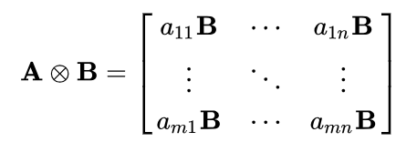
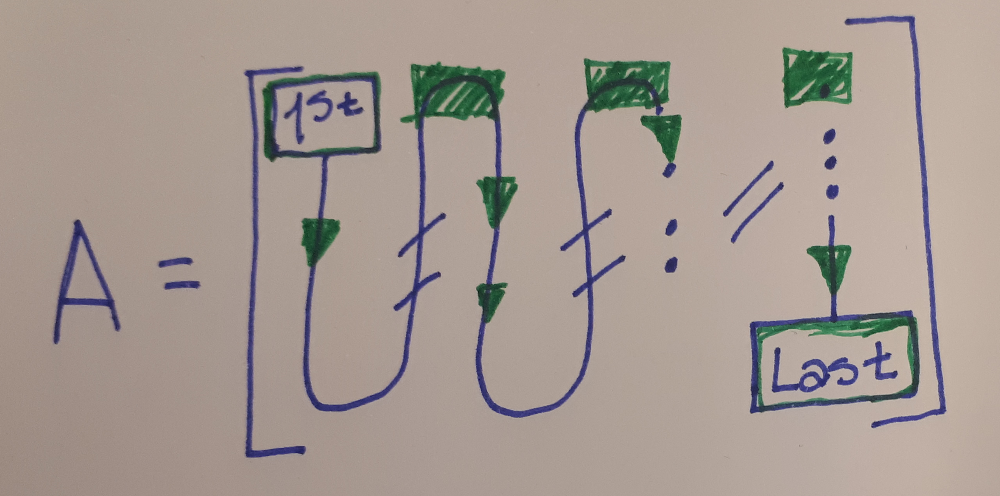
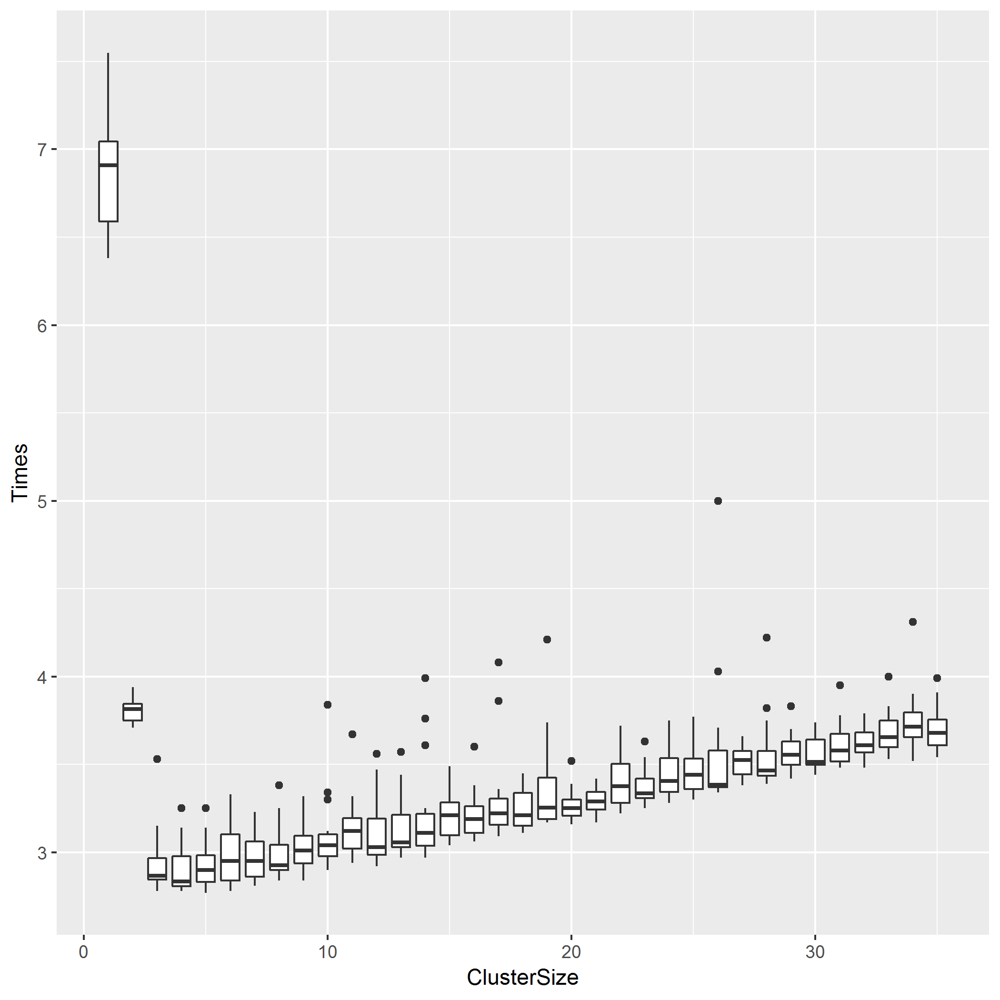
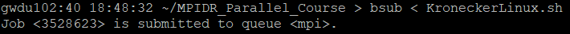
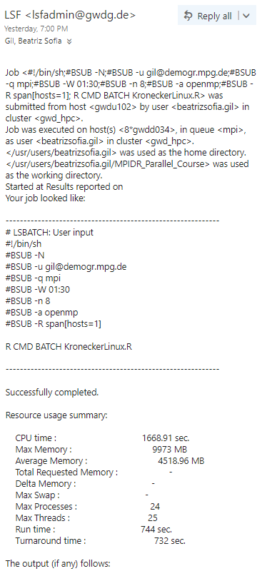
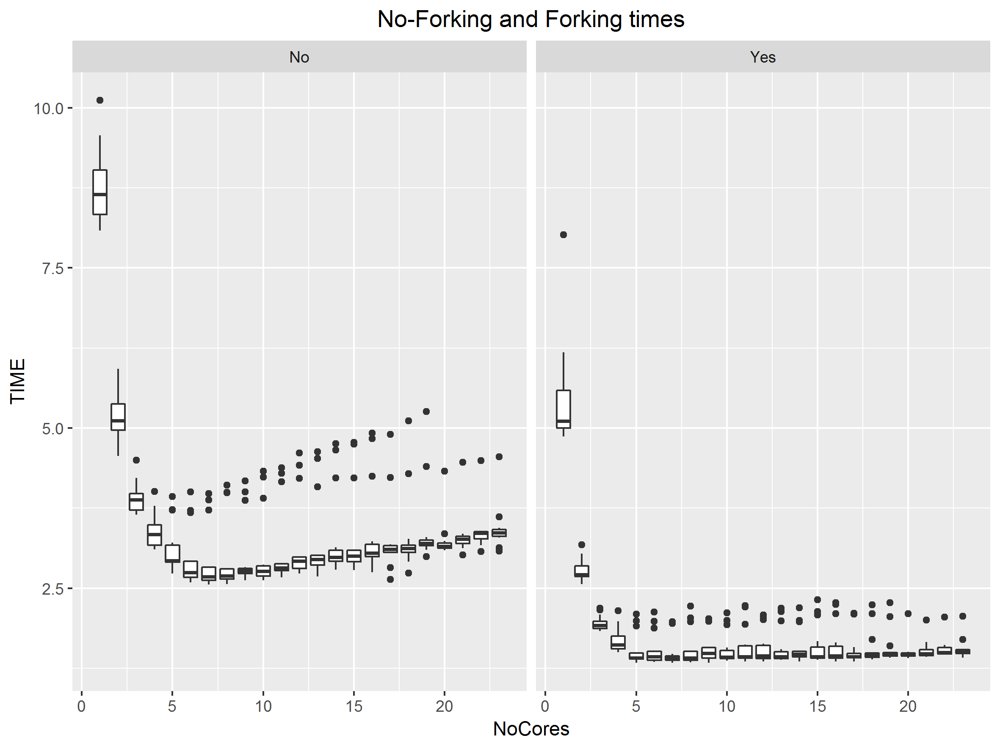
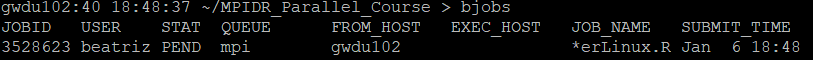
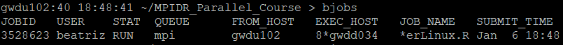
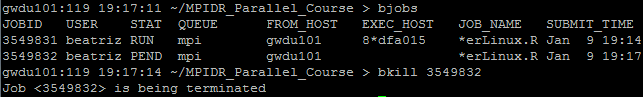

Hands-on lab (Second Part)
================
Sofia Gil
January 15, 2019

-   [Introduction](#introduction)
-   [1. Writing efficient loops](#writing-efficient-loops)
-   [2. Paralellizing](#paralellizing)
-   [3. Submitting R scripts into the cluster](#submitting-r-scripts-into-the-cluster)
-   [References](#references)

### Introduction

It is well-known that when we are using *R* we always have to avoid **for** loops. Due to the calls that *R* does to *C* functions, therefore it is better to vectorize everything.

``` r

rm(list=ls())
gc()
#>           used (Mb) gc trigger (Mb) max used (Mb)
#> Ncells  625751 33.5    1209490 64.6  1209490 64.6
#> Vcells 1137032  8.7    8388608 64.0  1661898 12.7

len<-5000000

a<-runif(len)
b<-runif(len)

c1=0

system.time({
  for(i in 1:length(a)){
    c1<-a[i]*b[i]+c1
  }
})['elapsed']
#> elapsed 
#>    0.41

system.time({c2<-a%*%b})['elapsed']
#> elapsed 
#>    0.03
```

But... what should we do when the problem we are facing needs a loop? There are two options:

1.  Write the loop.
2.  Paralellize.

Imagine we want to do the Kronecker Product of **A** ⊗ **B**, that means:



Where **A** and **B** are matrixes.

### 1. Writing efficient loops

**Memory access**: It is important to know how *R* stores matrices, i.e., by row or by column. In the specific case of *R*, all matrices (also data frames) are stored by column, given that *R* is a statistical software where the columns almost always represent variable names. This is crucial since each variable created in *R* has an **ID number**, so the compiler or the interpreter will assign specific addresses in memory at which every element of the variables (e.g. vector, matrices, data frames, lists,...) will be stored. Given that these addresses are consecutive, it will always decrease memory access time if we call them in a consecutive way.



``` r

(A<-matrix(runif(9),nrow = 3,ncol = 3))
#>           [,1]      [,2]      [,3]
#> [1,] 0.8447337 0.1981730 0.6313304
#> [2,] 0.3113982 0.2194922 0.8971745
#> [3,] 0.2973880 0.3904160 0.5834428

for(i in 1:length(A))
  print(paste(i,A[i]))
#> [1] "1 0.844733684556559"
#> [1] "2 0.311398230725899"
#> [1] "3 0.297388046514243"
#> [1] "4 0.198172956006601"
#> [1] "5 0.219492244534194"
#> [1] "6 0.390416000969708"
#> [1] "7 0.631330439820886"
#> [1] "8 0.897174456622452"
#> [1] "9 0.583442774135619"
```

For solving with a loop this basic knowledge can help to increase the pace of the algorithm.

``` r

library(foreach)

rm(list=ls())
gc()
#>           used (Mb) gc trigger  (Mb) max used (Mb)
#> Ncells  630860 33.7    1209490  64.6  1209490 64.6
#> Vcells 1145357  8.8   14904305 113.8 11330492 86.5

row=100
col=100

A<-matrix(runif(row*col),nrow = row,ncol = col)
B<-matrix(runif(row*col),nrow = row,ncol = col)

CR<-matrix(A,nrow = row^2,ncol = col^2)
CC<-matrix(A,nrow = row^2,ncol = col^2)

### By row 
system.time({
  CR<-foreach(j=1:row,.combine = 'rbind',.packages = 'foreach')%do%{
        foreach(i=1:length(A[j,]),.combine = 'cbind')%do%{
            A[j,i]*B
        }
  }
})['elapsed']
#> elapsed 
#>    6.49


### By column 
system.time({
  CC<-foreach(A2=A,.combine = 'cbind',.packages = 'foreach')%do%{
        foreach(i=1:length(A2),.combine = 'rbind')%do%{
            A2[i]*B
        }
  }
})['elapsed']
#> elapsed 
#>    4.45
```

### 2. Paralellizing

#### 2.1 Using *foreach - doPar*

There are several packages for parallelizing:

-   doParallel
-   Parallel
-   snow
-   multicore

Some of those packages are required by the others, so lets start with **doParallel**. Once we open this package in our session it will require **parallel**, which will automatically open the rest.

The easiest way to parallelize the loop above is using the package **foreach** in conjunction with **doParallel**.

``` r

library(doParallel)
#> Loading required package: iterators
#> Loading required package: parallel

(no_cores<-detectCores()-1)
#> [1] 35
```

Now we proceed to parallelize, for this it's necessary to call the *registerParallel* function.:

``` r

registerDoParallel()

getDoParWorkers()
#> [1] 3

system.time({
  C<-foreach(A2=A,.combine = 'cbind',.packages = 'foreach')%dopar%{
        foreach(i=1:length(A2),.combine = 'rbind')%do%{
            A2[i]*B
        }
  }
})['elapsed']
#> elapsed 
#>    2.96


stopImplicitCluster()
```

Anytime we initialize the cores using **registerDoParallel** there is no need to close the connections, they will be stopped automatically once the program detects they aren't used anymore.But anytime we want to explicitly require *R* to release them we can use **stopImplicitCluster**.

##### 2.1.1 Life is always a tradeoff

Once we become familiar on parallelizing, the idea that more cores mean less execution time start to wear off. For understanding this first, we need to introduce some new functions:

-   **makeCluster**: initializes all the cores or clusters that we require.
-   **stopCluster**: stops and releases the cores that we have initialized.

``` r

Times<-matrix(0,nrow=no_cores,ncol=20)

for(cols in 1:20){
  for(h in 1:no_cores){
    cls<-makeCluster(h)
    registerDoParallel(cls)
    Times[h,cols]<-system.time({
        foreach(A2=A,.combine = 'cbind',.packages = 'foreach')%dopar%{
          foreach(i=1:length(A2),.combine = 'rbind')%do%{
              A2[i]*B
          }
    }
    })['elapsed']
    stopCluster(cls)
  }
}

write.csv(Times2,'Times_Time_graph_DoPar_Hydra.csv',row.names = FALSE)
```

The next plot shows the boxplots of the time Hydra took to finish computing the Kronecker product depending the number of cores that we ask.



Given that the problem we are facing doesn't require a lot of computational effort to be solved, it is useless to ask for more cores, that just increases the communication requirement.

#### 2.2 Using *Master - Workers*

Now we will divide the task into subtasks that will be processed by different nodes (called workers) and that at the end will be managed by a master.

``` r

# Checking cores
detectCores()
#> [1] 36


doichunk<-function(chunk){
  require(foreach)
  MatC<-foreach(A2=A[,chunk],.combine = 'cbind',.packages = 'foreach')%do%{
    foreach(i=1:length(A2),.combine = 'rbind')%do%{
        A2[i]*B
    }
  }
  return(MatC)
}


ChunkKronecker<-function(cls,A,B){
  clusterExport(cls,c('A','B'))
  ichunks<-clusterSplit(cls,1:ncol(A)) # Split jobs
  tots<-clusterApply(cls,ichunks,doichunk)
  return(Reduce(cbind,tots))
}


cls<-makeCluster(4)
system.time(valor<-ChunkKronecker(cls,A,B))['elapsed']
#> elapsed 
#>    4.61
stopCluster(cls)
```

### 3. Submitting R scripts into the cluster

#### 3.1 Forking

From now on, the operating system will be Linux. Linux and Windows have significant differences from each other, not only in the graphic user interface, but also in their architectural level. One of the main differences is that Windows doesn't fork and Linux does. That means that Linux make copies of the needed variables in all the cores, instead of forcing the cores to queue and wait for using the shared variables.

Let's check what happens if instead of **makeCluster** we use **makeForkCluster** (attention: this function is only available for Linux) for the Kronecker product.

``` r

rm(list=ls())
gc()

row=100
col=100

A<-matrix(runif(row*col),nrow = row,ncol = col)
B<-matrix(runif(row*col),nrow = row,ncol = col)


library(doParallel)

detectCores()

no_cores<-5 # Practical reasons

#### Forking ####
#### Normal ####

TimesN<-rep(0,no_cores)

for(h in 1:no_cores){
  cls<-makeForkCluster(h)
  registerDoParallel(cls)
  TimesN[h]<-system.time({
    foreach(A2=A,.combine = 'cbind',.packages = 'foreach')%dopar%{
      foreach(i=1:length(A2),.combine = 'rbind')%do%{
        A2[i]*B
      }
    }
  })['elapsed']
  stopCluster(cls)
}


#### Master - Workers ####

doichunk<-function(chunk){
  require(foreach)
  MatC<-foreach(A2=A[,chunk],.combine = 'cbind',.packages = 'foreach')%do%{
    foreach(i=1:length(A2),.combine = 'rbind')%do%{
      A2[i]*B
    }
  }
  return(MatC)
}


ChunkKronecker<-function(cls,A,B){
  clusterExport(cls,c('A','B'))
  ichunks<-clusterSplit(cls,1:ncol(A)) # Split jobs
  tots<-clusterApply(cls,ichunks,doichunk)
  return(Reduce(cbind,tots))
}


TimesC<-rep(0,no_cores)

for(i in 1:no_cores){
  cls<-makeForkCluster(i)
  TimesC[i]<-system.time(valor<-ChunkKronecker(cls,A,B))['elapsed']
  stopCluster(cls)
}


Times<-data.frame(NoCores=1:no_cores,Normal=TimesN, Workers=TimesC)

write.csv(Times,'TimesFork.csv')


#### No Forking ####
#### Normal ####

TimesN<-rep(0,no_cores)

for(h in 1:no_cores){
  cls<-makeCluster(h)
  registerDoParallel(cls)
  TimesN[h]<-system.time({
    foreach(A2=A,.combine = 'cbind',.packages = 'foreach')%dopar%{
      foreach(i=1:length(A2),.combine = 'rbind')%do%{
        A2[i]*B
      }
    }
  })['elapsed']
  stopCluster(cls)
}


#### Master - Workers ####

doichunk<-function(chunk){
  library(foreach)
  MatC<-foreach(A2=A[,chunk],.combine = 'cbind',.packages = 'foreach')%do%{
    foreach(i=1:length(A2),.combine = 'rbind')%do%{
      A2[i]*B
    }
  }
  return(MatC)
}


ChunkKronecker<-function(cls,A,B){
  clusterExport(cls,c('A','B'))
  ichunks<-clusterSplit(cls,1:ncol(A)) # Split jobs
  tots<-clusterApply(cls,ichunks,doichunk)
  return(Reduce(cbind,tots))
}


TimesC<-rep(0,no_cores)

for(i in 1:no_cores){
  cls<-makeCluster(i)
  TimesC[i]<-system.time(valor<-ChunkKronecker(cls,A,B))['elapsed']
  stopCluster(cls)
}


Times<-data.frame(NoCores=1:no_cores,Normal=TimesN, Workers=TimesC)

write.csv(Times,'TimesNoFork.csv')
```

#### 3.2 Preparing the Shell file for a parallel job

The shell files can be created through either the linux terminal using the editor *nano* or Notepad++ in Windows.

``` r

> nano NameShell.sh

------------------------
#!/bin/sh 
#BSUB -N 
#BSUB -u <YourEmail>
#BSUB -q mpi 
#BSUB -W <max runtime in hh:mm>
#BSUB -o NameOutput.%J.txt 
#BSUB -n <min>,<max> or <exact number> 
#BSUB -a openmp 
#BSUB -R span[hosts=1] 
 
R CMD BATCH NameCode.R
--------------------------
```

-   **Rspan\[hosts=1\]** runs the job on a host that meets the specified resource requirements.
-   **n**: submits a parallel job and specifies the number of tasks in the job.
-   **a**: this option denotes a wrapper script required to run SMP or MPI jobs. By default we use[1]:
    -   Shared Memory (**openmp**). This is a type of parallel job that runs multiple threads or processes on a single multi-core machine. OpenMP programs are a type of shared memory parallel program.

``` r
> bsub < NameShell.sh
```

So, for submiting our job the shell file would look like the next one:

``` r

> nano KroneckerLinux.sh

------------------------
#!/bin/sh 
#BSUB -N 
#BSUB -u gil@demogr.mpg.de
#BSUB -q mpi 
#BSUB -W 00:30
#BSUB -n 8 
#BSUB -a openmp 
#BSUB -R span[hosts=1] 
 
R CMD BATCH KroneckerLinux.R
--------------------------
```

``` r
> bsub < KroneckerLinux.sh
```

Once we submit the job in the cluster it will look like:



Once





#### 3.3 Some important LSF commands

-   bjobs: lists currents jobs.

While not having a job slot:



Once having a job slot:



-   bkill <jobid>: stops the current job.



### References


<https://info.gwdg.de/dokuwiki/lib/exe/fetch.php?media=en:services:scientific_compute_cluster:parallelkurs.pdf>

[1] <https://wiki.uiowa.edu/display/hpcdocs/Advanced+Job+Submission>
